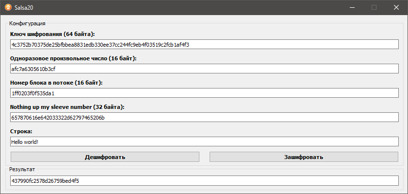

------------------
# INFORMATION #
------------------

Salsa20 is a family of stream ciphers designed by Daniel J. Bernstein in 2005. Stream ciphers are a type of encryption algorithm that encrypts data on a bit-by-bit basis, as opposed to block ciphers that encrypt data in fixed-size blocks.

This program can encrypt and decrypt text using the Salsa20 crypto algorithm.
- The algorithm is written without using libraries
- The GUI is written in PyQt5

The code is based on: https://github.com/phantom-dreamer/Salsa20
